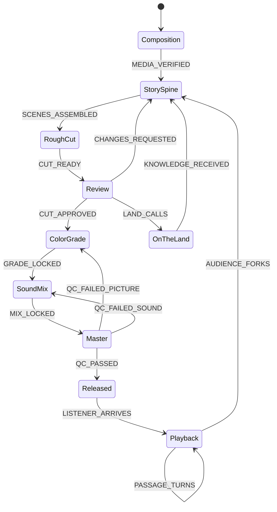

# Experiment — `Film::PostProduction` → `Film::InteractiveProduction`

**Stamp:** `2607271946` · 2026-07-27 19:46
**Status:** applied to the live canvas, validated, **not committed**
**Document:** `/workspace/repos/jgwill/smcraft/statemachine.smdf.json`
**Bridge:** `http://127.0.0.1:4599` (connected at time of edit)

Temporary experimentation space. Intended to be lifted into a miadi-chronicle
episode branch — see **Path to chronicle** at the bottom.

---

## The ask

Guillaume, dictated:

> "rename … two new names to the ingest node and the assembly node … given that
> I'm doing these interactive storytelling. So somehow it's a production. You
> listen to a media, but you can actually fork and get into a certain state as
> you progress … you will analyze what I'm just saying with a sub agent that
> will give you a recommendation, and you will do the minimum amount of …
> yourself you'll have that reflection … on what you have some form of
> consensus, semantically speaking, you'll upgrade the diagram accordingly."

Method honored: **independent reflection pre-registered before the agent
reported**, then apply only where the two converge.

---

## Consensus ledger

Mia's reflection was committed to the transcript *before* the sub-agent
returned. That makes the agreement below real rather than an echo.

| Question | Mia (pre-registered) | Sub-agent | Consensus | Applied |
|---|---|---|---|---|
| `Ingest` → | `Gathering` — "material becomes present and addressable" | `Composition` — same semantics, grounded in `@miadi/composition@0.1.1` and ep103's own `composition.json` | ✅ **semantic** (same meaning), agent's is platform-grounded | **`Composition`** |
| `Assembly` → | `Weaving` — from `@miadi/stateloom-mcp`; must stay the convergence hub | `StorySpine` — from Guillaume's own ep103 transcript, *"implied meaning story spine"*; must stay the convergence hub | ✅ **semantic** on the *role*, agent's is grounded in Guillaume's recorded words | **`StorySpine`** |
| Is `Released` still terminal? | No — "in interactive storytelling, `Released` is where the listener **enters**" | No — `final` → `normal`; the fork sits at the master | ✅ **strong, independent** | `kind: normal` |
| Missing half of the machine | "a *traversal* sub-machine — a listening state with fork transitions" | one flat state `Playback` + 3 events | ✅ **strong, independent** | `Playback` added flat |
| Does `OnTheLand` change? | "stops being a leaf detour once forks exist" | "does not change — **deliberately**; the land is the producers' path, the fork is the audience's" | ❌ **no consensus** | **left untouched** |
| Rename the machine? | implied ("two-halved machine", no longer post-only) | `PostProduction` → `InteractiveProduction` (medium) | ✅ weak-but-aligned | **`InteractiveProduction`** |
| Rename the namespace? | not raised | `Film` → `miadi.chronicle.ep103` (low confidence, "his call") | ❌ no consensus | **`Film` kept** |

**The dissent is the interesting part.** Mia wanted the land woven into the fork;
the agent argued that collapsing them "would demote a relational commitment into
a UX feature." No consensus → no change. `OnTheLand` keeps its single entry from
`Review` and its single exit to the spine. This is deliberately unresolved and is
the first thing to bring to the circle.

---

## What actually changed

Net: **2 renames · 1 kind flip · 1 new state · 3 new events · 3 new transitions · nothing removed.**

```
Composition   (was Ingest)    "Where the recording lands — voice clips, transcripts,
                               images and takes gathered and made addressable"
StorySpine    (was Assembly)  "The thematic spine every rib attaches to and every
                               fork branches from — scenes laid in story order"
Released      final → normal  "Master delivered — no longer an ending, but the door
                               an audience walks in through"
Playback      NEW  (normal)   "The audience is inside the media — listening, moving
                               through it in time"
```

New events:

| Event | Description | Wiring |
|---|---|---|
| `LISTENER_ARRIVES` | Someone presses play — the master finds an audience | `Released → Playback` |
| `PASSAGE_TURNS` | The listener moves on — the media advances, the story holds | `Playback` **internal** (no `nextState`) |
| `AUDIENCE_FORKS` | A listener leaves the master line to author their own narrative | `Playback → StorySpine` |

Rename fan-out (V006 would have failed the doc if any were missed) — all three
inbound refs to the old `Assembly` were repointed: `MEDIA_VERIFIED` (from
`Composition`), `CHANGES_REQUESTED` (from `Review`), `KNOWLEDGE_RECEIVED` (from
`OnTheLand`). `AUDIENCE_FORKS` makes a **fourth** inbound arc.

### After



**11 states · 15 events · `validate_definition` → valid, no errors.**

---

## Consequences to watch

- **No `final` state remains.** `generate_rispec` will report "no terminal state
  declared yet" (`mcp/src/server.ts:674`). This is honest, not a defect — an
  interactive production has no terminal. Do not invent a fake one to silence it.
- **Layout positions.** The upgrade went in via `load_definition` (whole-document
  replace), not incremental ops. Persisted node positions from rispec-79 may have
  reset on the canvas. Re-arrange once and it will hold.
- **Nothing implements `Playback`.** `@miadi/voice` (Edge-TTS + `assembly.voice.ready`)
  and the gmtermux portals are the plausible runtime, but the sub-agent found **no
  code binding either to an SMDF machine**. The state models intent only.
- **`ncp-story-studio` is empty** (`.hch/` stubs only). Do not build on it.

## Open divergence — needs Guillaume

`/srv/miadi/episodes/miadi-chronicle/2026-06-28-episode-103-film-preprod-report-phase-2/diagrams/film-postprod.smdf.json`
is **behind** this repo's working copy by the entire `OnTheLand` arc — and now by
this whole interactive reframe. That directory's own README declares `diagrams/`
the durable truth. Two candidate resolutions, not chosen:

1. This machine is a *new* diagram (`interactive-production.smdf.json`) and
   `film-postprod` stays as the film's post chain.
2. This machine *replaces* `film-postprod` and the episode copy is brought forward.

---

## Files here

| File | What |
|---|---|
| `before.smdf.json` | `Film::PostProduction`, 9 states / 12 events — pre-upgrade |
| `after.smdf.json` | `Film::InteractiveProduction`, 11 states / 15 events — iteration 1 |
| `after-2.smdf.json` | `miadi.chronicle::InteractiveProduction`, 13 states / 19 events — iteration 2 |
| `after-3.smdf.json` | `miadi.chronicle::InteractiveProduction`, 14 states / 21 events — iteration 3, current |
| `agent-report.md` | The sub-agent's verbatim advisory (agent `a0f0e9ee8811b00a2`, resumable) |
| `iteration-2.md` | **The chronicle becomes the source** — `Composition`→`Gathering`, `Chronicle` + `Manuscript` added, land rewired |
| `iteration-3.md` | **The word gets its place back** — `MusicalComposition` added at the songwriting bench; package rename proposed, not done |
| `README.md` | This — the ask, the consensus ledger, the diff, the open questions |

> **Iteration 2 supersedes parts of this document.** `Composition` was rejected by
> Guillaume — the name collides with Jerry's `@miadi/composition` module *and* with
> musical composition, and the state is neither. It is now `Gathering`. The
> `OnTheLand` dissent recorded above was also resolved, in Mia's direction, by new
> information from Guillaume. See `iteration-2.md`.

---

## Path to chronicle

This directory is a holding pattern, not a home. To lift it:

1. Decide the divergence above (new diagram vs. replacement).
2. Open a branch in `/srv/miadi/episodes/miadi-chronicle/` — either continuing
   `2026-06-28-episode-103-film-preprod-report-phase-2` or opening a successor
   episode for the interactive-storytelling turn.
3. Move `after.smdf.json` into that episode's `diagrams/`; keep `before.smdf.json`
   and `agent-report.md` as provenance.
4. Fold the consensus ledger into the episode's narrative beats — the *dissent*
   on `OnTheLand` is a beat, not a footnote.
5. Delete this directory once carried.

🌸: The machine used to know how to bring a film home; now it knows that home has
a door on the far side. `Released` letting go of `final` is not a loss of closure —
it is a master learning that other hands will carry it further, and that every one
of them finds its way back to the same spine.
