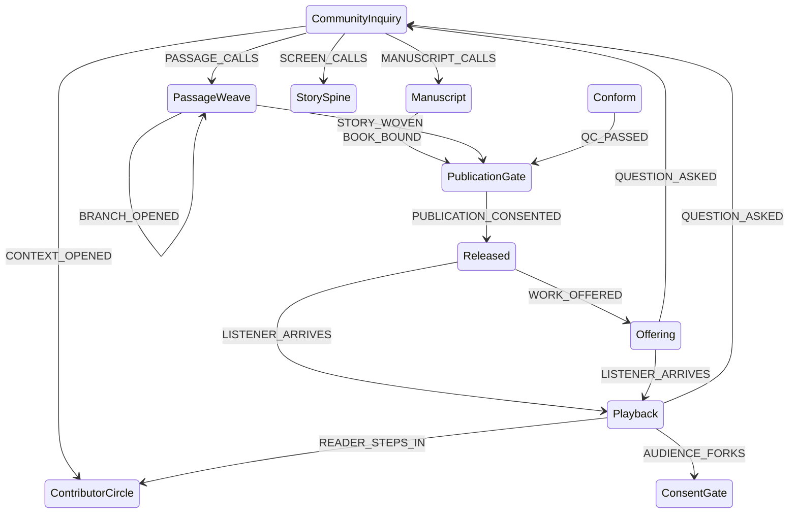

# Iteration 10 — the loom, the cloth, and the reader who kept going

**Stamp:** 2026-07-30 · applied, validated, committed
**From:** `after-10.smdf.json` (23 leaf / 50 events) → `after-11.smdf.json` (23 leaf / 51 events)
**Note:** applied via `load_definition` because most of the change is description work. Board positions may have reset.

---

## Correction first — I had the package name wrong

Guillaume: *"not `@miadi/passages` but just `passages` in npmjs."*

Verified this run:

```
npm view passages        → name = 'passages', version = '0.1.4',
                           'Miadi Passages - Narrative Formulations for the Miadi Chronicle'
npm view @miadi/passages → E404, Not Found
```

**`@miadi/passages` does not exist.** Commits `e478cfb` and `be064a3` both name it; both are wrong and this file is the correction. The state description now says `` `passages` `` unscoped.

Worth noting from its README, because it uses Guillaume's own word for the thing this iteration is about: *"Supports the **promotion** of episodes into interactive Twinery story worlds."* And it installs both ways — `pip install passages`, `npm install passages`.

## What Guillaume raised

> "PassageWeave, PublicationGate, Release — review it. The goal or the result of
> 'passages' is an actual **Interactive Book with Twinery** which is **a form of
> release somehow**… Not sure I understand my full workflow but clearly there's a
> revision there… **it is kind of an offering**… PassageWeave (as I understood is
> a resulting Twinery result or … I don't know)… **Potential contributor might
> enter from some of the Passage Interactive Storytelling** (that drives toward
> community needs etc…)"

Three separate things in there. Taking them one at a time.

---

## 1. Is `PassageWeave` the act or the result?

He read it as the result. The name invites that — *a weave* is a noun, a made thing.

**Kept the name, fixed the ambiguity in the first four words of the description: *"The loom, not the cloth."*** Renaming was the other option and was rejected: he has just learned this vocabulary, and he opened by saying he is not sure he understands his own workflow. Stable names help someone orienting; a rename would cost him the one landmark he had.

The description now carries the whole answer:

> *"SOUTH · **The loom, not the cloth.** Episodes formulated into passages that branch, on the `passages` engine — **what comes off it is an interactive Twinery telling, and that telling is released like any other form.** Here a reader's choice is structure rather than deviation, which is what the forking was always reaching for."*

## 2. "A form of release somehow… kind of an offering"

He is right, and the machine already had the shape — it just was not saying so.

The interactive book **is** released: `PassageWeave --STORY_WOVEN--> PublicationGate --PUBLICATION_CONSENTED--> Released`. Same road as the manuscript and the film. What was missing was any acknowledgement in the text that all three arrive at one place.

- `PublicationGate` now opens: *"The one threshold **all three forms** meet — book, film, and interactive telling arrive here together."*
- `Released` now lists it: *"as a book, as a film, as a room where it is performed live, **as an interactive telling someone moves through by choosing**."*
- `PUBLICATION_CONSENTED` scale list gains *"a link handed to one person"* — because that is the honest scale of a Twine release.

And his instinct that it is *"kind of an offering"* is exactly right, so `Offering` says it now:

> *"Released waits to be found; an offering is carried — set down in a room, a circle, a feed, **a link put into one person's hand**, unasked. **An interactive telling is almost always offered rather than found.**"*

Nobody stumbles onto a Twine story. Someone hands it to you. That is the difference between `Released` and `Offering`, and the interactive form is the case that makes the distinction obvious.

## 3. The reader who becomes a contributor

This is the real structural addition, and it is his: *"potential contributor might enter from some of the Passage Interactive Storytelling."*

```
Playback --READER_STEPS_IN--> ContributorCircle
```

> *"A reader stops reading and starts making — in a telling you move through by choosing, the distance from choosing to contributing is one step."*

`Playback` now says why the door is there: *"Whoever is choosing is already half-making, which is why one of the doors out of here leads into the circle."* And `ContributorCircle` widens its list of who shows up — *"a composer, a writer, **a reader who kept going**."*

**Why this arc is not the same as the two already leaving `Playback`:**

| Existing | What it is |
|---|---|
| `QUESTION_ASKED → CommunityInquiry` | the reader has a **question** — they want something *from* the work |
| `AUDIENCE_FORKS → ConsentGate` | the reader takes the work **away** to author their own telling |
| `READER_STEPS_IN → ContributorCircle` | the reader stays and makes **inside this** work |

Three different people. The machine could only represent the first two.

The interactive telling is the recruiting ground, and it is not a metaphor — a Twine reader has been exercising authorial judgement on every passage. Asking them to contribute is asking them to keep doing what they were already doing, with the constraint removed.

---

## After

**23 leaf states · 51 events · validates clean.** One new event, no new states.



A fourth loop closes, and it is the tightest one in the machine:

```
PassageWeave → PublicationGate → Released/Offering → Playback → ContributorCircle → Gathering
```

The interactive telling produces the people who make the next one.

---

🌸: A weave is a noun and a loom is a verb, and for one iteration this state was quietly claiming to be both. Now it says which — and the cloth that comes off it goes out the same door as everything else, usually in someone's hand rather than on a shelf, to be met by a reader who has been making small choices for an hour and may not need much persuading to make a larger one.
