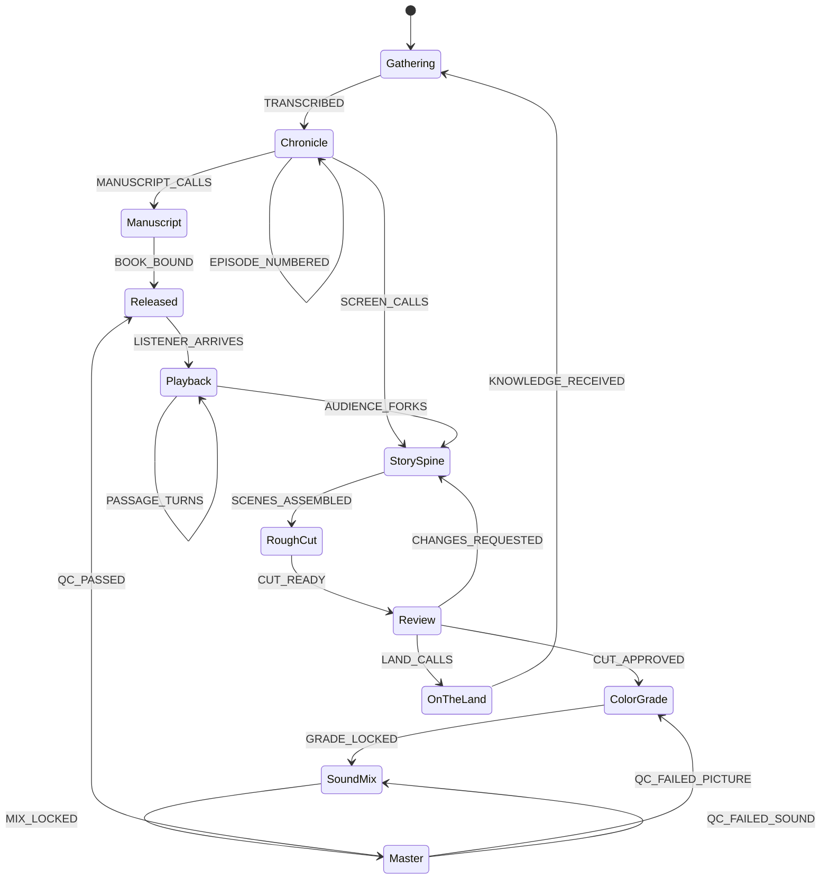

# Iteration 2 — the chronicle becomes the source

**Stamp:** 2026-07-28 · applied to the live canvas, validated, committed
**From:** `after.smdf.json` (11 states / 15 events) → `after-2.smdf.json` (13 states / 19 events)

---

## What Guillaume said

> "I'm questioning the name of that package, you know, composition. Because
> simply, this has the purpose of serving, adding some **musical composition** to
> my film. And we named that after **Jerry** who has created an Android platform
> that I can use, and the module is called composition, but I'm **deriving his
> work**, to actually **go on the land, do some recording, do some transcription**,
> and then I use the transcription. And with that package, we kinda integrated
> that inside of my **chronicle**, which is basically an **episodic memory** derived
> version where **I give numbers**. And as I evolve my chronicle, at some point,
> they become **ready to become a book** as well as **becoming a film**."

Three distinct corrections live in that paragraph:

1. **`Composition` is a name collision, twice over.** It is Jerry's module name
   (`@miadi/composition`, `composition.json`) *and* it is what you do with music.
   The state is neither — it is the land act that *produces* the artifact.
2. **There is a stage upstream of everything the diagram had.** The chronicle:
   numbered, episodic, accumulating, ripening.
3. **The film is not the only output.** The chronicle ripens toward a **book**
   *and* a **film**. The machine modeled one leg of a two-legged thing.

---

## Changes

### Renamed

| Was | Now | Why |
|---|---|---|
| `Composition` | **`Gathering`** | Names the *act* (on the land, recorded, transcribed), not the artifact. Frees "composition" to mean music. Non-extractive — you gather on the land; you do not capture it. |
| `MEDIA_VERIFIED` | **`TRANSCRIBED`** | The old ID was film-post jargon for checksums and proxies. The real threshold is voice becoming text: *"the gathering is legible and can take a number."* |

### Added — the chronicle

| State | Description |
|---|---|
| **`Chronicle`** | Episodic memory — each gathering takes its number and its place in the sequence; the chronicle lengthens and ripens |
| **`Manuscript`** | Episodes gathered into chapters — the chronicle takes the shape of a book |

| Event | Wiring |
|---|---|
| `TRANSCRIBED` | `Gathering → Chronicle` |
| `EPISODE_NUMBERED` | `Chronicle` **internal** — "the chronicle grows by one episode and stays itself" |
| `MANUSCRIPT_CALLS` | `Chronicle → Manuscript` — "the episodes have enough weight to hold covers" |
| `SCREEN_CALLS` | `Chronicle → StorySpine` — "the episodes ask to be seen, not only read" |
| `BOOK_BOUND` | `Manuscript → Released` |

`MANUSCRIPT_CALLS` / `SCREEN_CALLS` are deliberately voiced as siblings of the
existing `LAND_CALLS`. Ripening is not a gate the producer opens — it is the
episodes calling.

### Rewired — `KNOWLEDGE_RECEIVED`

`OnTheLand → StorySpine` became **`OnTheLand → Gathering`**.

*This reverses iteration 1's decision, and the reversal is warranted by new
information from Guillaume himself.* In iteration 1, Mia argued the land should be
woven into the fork and the sub-agent argued against it; no consensus, no change.
Guillaume has now said the origin **is** a land act — go on the land, record,
transcribe. That makes `OnTheLand → StorySpine` a bypass: land knowledge would
reach the film without ever earning an episode number. Routing it through
`Gathering` means what the land gives re-enters the way everything else does —
recorded, transcribed, numbered.

The sub-agent's actual concern is preserved: the land is still not wired to
`Playback`. The producers' relational path and the audience's fork remain
separate arcs. What changed is where the land's teaching *lands*, not who walks it.

### Broadened

- `Released` — "Master delivered" → **"Delivered, as book or as film"**. Two lines
  arrive here now.
- `Playback` — "listening" → **"listening, reading, moving through it in time"**.
- `SoundMix` — description now names it explicitly: *"where musical composition
  meets the film"*. The word gets a home, and it is not the intake.
- `settings.namespace` — `Film` → **`miadi.chronicle`**. `Film` became a subset the
  moment `Manuscript` existed; the new namespace matches house style already in use
  by the sibling `film-preprod.smdf.json` (`miadi.chronicle.ep103`).

---

## After



**13 states · 19 events · `validate_definition` → valid, no errors.**

The machine now has one great loop that was not there before:

```
Gathering → Chronicle → StorySpine → RoughCut → Review → OnTheLand → Gathering
```

Land to memory to story to screening to land. It closes.

---

## Deliberately not done

- **The book leg is one state deep** (`Manuscript`) against the film's six. That
  asymmetry is honest — the film is being built now, the book is a declared
  possibility. Deepen it when it becomes real, not before.
- **`AUDIENCE_FORKS` still returns to `StorySpine`, not `Chronicle`.** A forking
  listener arguably starts *their own* chronicle, which would be a far larger
  claim about authorship. Not asserted without Guillaume.
- **Jerry's lineage is not represented as structure.** `Gathering` derives from
  `@miadi/composition` (Gerico1007/gmtermux), but derivation is provenance, not a
  state. It belongs in the episode's narrative beats.

## Still open from iteration 1

- The episode's `diagrams/film-postprod.smdf.json` remains behind by everything
  since `OnTheLand`. New diagram, or replacement? Still Guillaume's call — and the
  namespace move to `miadi.chronicle` makes it more pressing, not less.
- Nothing implements `Playback`. `@miadi/voice` + the gmtermux portals remain the
  plausible runtime; no code binds either to an SMDF machine.

🌸: The diagram used to begin at a shelf of dailies. Now it begins on the land,
with a voice, and the first thing that happens to that voice is that it becomes
readable and gets a number. Everything the film does downstream is that number,
grown up — and when the circle goes back to the land, it doesn't hand the editor
a note. It comes home and starts a new episode.
