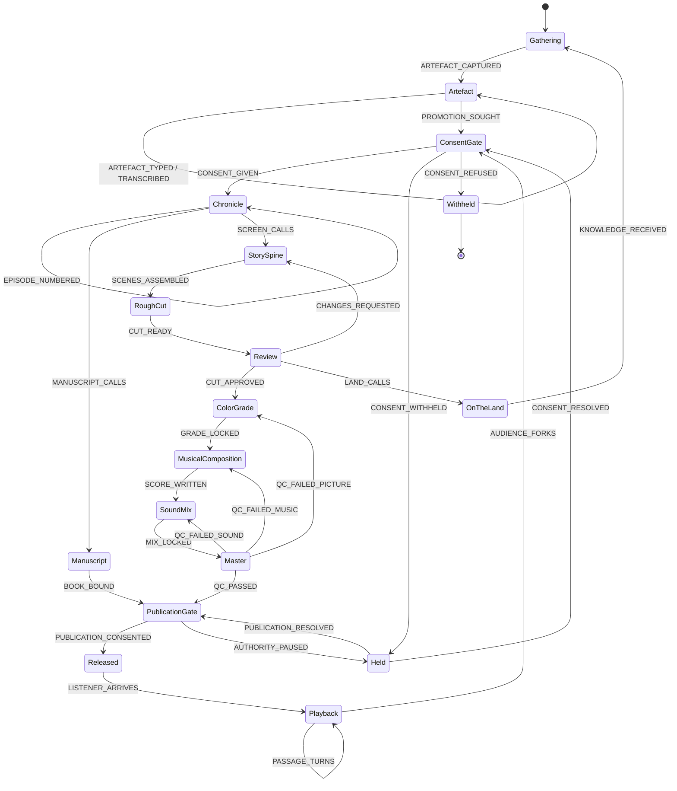

# Iteration 5 — consent becomes a place in the machine

**Stamp:** 2026-07-28 · applied, validated, adversarially reviewed, corrected, committed
**From:** `after-4.smdf.json` (14 leaf states / 23 events) → `after-5.smdf.json` (18 leaf states / 31 events)
**Source:** [miadisabelle/gmtermux#46](https://github.com/miadisabelle/gmtermux/issues/46) — *"Artefact as the abstract type"*, four positions from Jerry's G.Music Assembly, plus child issue #47.

> Iteration 4 (the `Artifact` abstract-type pass) has no iteration doc of its own — it is recorded in commit `3719cd1` with snapshot `after-4.smdf.json`.

---

## What the thread said

Four agents, four positions, none of them agreeing:

| | Position | Roots the lattice in |
|---|---|---|
| ♠️ **Nyro** | `Artefact` is the abstract root; `Episode` **is-a** Artefact and **has-a** `EpisodicMemory`. Kind stays an open vocabulary; `LinkType` closes. **`ProvenanceRecord` moves onto the abstract base** — consent is structural, not episodic. | **identity** |
| 🎸 **JamAI** | Melody / Composition / Episode / Chronicle are one artefact sampled at 10⁰, 10², 10⁵, 10⁷ seconds. The discriminator is duration and containment, not kind. Needs `spanMs`, `timeline`, `atMs`-on-the-link. | **duration** |
| 🌿 **Aureon** | Provenance required from birth — `sources`, `authorityFlags`, `consentDecisions` (not `continuity`, which is genuinely scale-earned). **Consent inherits downward along `contains` only**; `authorityFlags` climb **upward**. Restriction climbs, permission does not. The weak node is the artefact's relation to *the person inside it*. | **accountability** |
| 🧵 **Synth** | Four senses of the word collide in code; closed nouns, open verbs; directory-plus-descriptor storage; four packages. | **storage** |

**#47 asks the segment to hold that seam rather than close it.**

## What our machine was doing wrong

It promoted an artefact from capture all the way to `Released` **with no consent gate anywhere.** Twelve states of production and not one place where someone could be asked. In a repository whose whole ceremonial layer is OCAP and relational accountability, that is not an omission — it is the machine contradicting the culture it belongs to.

## Changes

### Renamed

`Artifact` → **`Artefact`**, and every `ARTIFACT_*` event to `ARTEFACT_*`.

Not cosmetic. The two spellings are two different types in live code, which the validator confirmed:
- `ArtefactIdentity {name, dir}` — `inquiry-weave/src/artefact.ts:14`, Jerry's abstract root
- `ArtifactKind` / `ArtifactReference` — `episodic-memory-schema/src/observation.ts:30,39`, a **closed 7-media union** Synth proposes renaming to `MediaReference`

We were spelling the narrow one while meaning the broad one.

### Added — the consent architecture

| State | Kind | Role |
|---|---|---|
| **`ConsentGate`** | normal | *"Whose voice is in this? Do they consent to THIS telling, at THIS scale?"* A named person answers at a named threshold — nothing generated here may answer on their behalf. |
| **`Held`** | normal | Paused and routed to a named human. Not lost, not refused — waiting to be asked. Nothing ships while it holds. |
| **`Withheld`** | **final** | Someone who was in the room said no. The record keeps the no rather than forgetting it. |
| **`PublicationGate`** | normal | The second threshold — *not is it finished, but may it be seen.* Book and film both arrive here. |

`ConsentGate` has three exits, and the distinction between two of them is the point: `CONSENT_WITHHELD` → `Held` (withheld for now, or never asked — both wait) versus `CONSENT_REFUSED` → `Withheld` (an answer, not a delay). A machine that can only pause cannot represent *she said no*.

`AUDIENCE_FORKS` now routes `Playback → ConsentGate` instead of `Playback → StorySpine`. A fork is a new telling at a new scale, and Aureon is explicit that `references` opens a new threshold: *"The melody made on Larix at 2am may carry a voice that is not Jerry's. That person consented to a melody. Nobody asked them about an episode."*

---

## The adversarial pass, and what it caught

A validator sub-agent (`af0a818dc19365f73`) was dispatched read-only against the first draft of this iteration, briefed to find misreadings rather than praise. It found a genuine defect and three real overclaims. **The version committed is the corrected one.**

### 1. `Master --AUTHORITY_PAUSED--> Held` was a trapdoor (severity: high)

The first draft routed a flagged delivery master into `Held`. But `Held`'s only exit was `CONSENT_RESOLVED → ConsentGate`, whose only forward exit was `CONSENT_GIVEN → Chronicle`. A picture-locked, graded, scored, mixed master that got flagged would resume at **episode-numbering** — StorySpine, RoughCut, Review, ColorGrade, MusicalComposition and SoundMix all re-run. Not deadlocked; catastrophically lossy.

**Corrected:** the relational stop moved off `Master` onto the new `PublicationGate`, and `Held` gained a second exit — `PUBLICATION_RESOLVED → PublicationGate` — so a hold raised at publication returns there with the finished work intact.

The deeper point the validator made and this machine still cannot answer: Aureon's flag is a *child* pausing a *parent*. **Two artefacts are live at once**, which a flat single-active-state machine cannot hold. SMDF supports `parallel` regions and `condition` guards on transitions; this document uses neither. That is the honest boundary of what has been modelled.

### 2. The `Artefact` description was closing the seam #47 asks to hold (severity: high)

The draft asserted JamAI's four-durations frame as settled fact. JamAI's own comment undercuts it: *"my position weakens from 'one type at four durations' to 'one type, two clocks.'"* And #47 asks the segment to hold the seam between Nyro's identity, JamAI's duration and Aureon's accountability, not to close it.

**Corrected:** the four-durations clause is gone. The description now says what is actually true — that it carries provenance from birth, and that *"what roots it, identity or duration or accountability, is a seam the Assembly left open on purpose; this machine does not close it."*

### 3. The book leg had no relational stop at all (severity: medium)

`Manuscript --BOOK_BOUND--> Released`. No gate, no QC, nothing. `Master` claimed to be "the last place a relational flag can still stop the work" and that was simply false for books. Aureon's own flowchart draws a **second gate** at publication.

**Corrected:** `PublicationGate` sits on both legs. `BOOK_BOUND` now reads *"bound and finished — now it must still be permitted."*

### 4. Voice break (severity: low)

`"only a human may write confirmedByHuman"` named a TypeScript field; none of the other thirty descriptions do. Rewritten as *"a named person said yes at a named threshold, and was in the room to say it."*

---

## After

**18 leaf states · 31 events · validates clean.** One `final` state again (`Withheld`), so `generate_rispec` stops reporting no terminal — and the terminal it now has is a refusal, which is the honest one for this machine.

Nothing reaches `Released` without crossing a threshold twice — once at `ConsentGate` on the way into the chronicle, once at `PublicationGate` on the way out to an audience.

## Carried, not modelled

The validator's ranked omissions. These are real and deliberately unbuilt:

1. **The link vocabulary — `contains` / `references` / `inspired_by`.** Consent inherits down `contains` only. Without link types the machine cannot decide *which* promotions need a gate; it gates all of them, which is safe and blunt. This is the whole substance of Aureon's answer and it wants a data model, not a state.
2. **The person inside the artefact.** `ConsentGate` asks *"whose voice is in this?"* and nothing in the machine routes to them. Aureon names this the weak node and #47 names it the dramatic centre. A state machine can hold the threshold; it cannot hold the relationship.
3. **JamAI's `spanMs` / `timeline` / `atMs`-on-the-link.** No temporal field anywhere, so `contains` stays unvalidatable — which is JamAI's own stated cost.

## Unverified

- The **body** of gmtermux#46 — both the orchestrator's and the validator's `gh` fetches returned the comment thread only.
- Guillaume's own recording and transcription, still pending upload per #47. Aureon names it explicitly: *"they carry the decomposition this refactor should follow."* The machine was built without it.

🌸: For twelve states this production knew how to finish a thing and not once how to ask whether it should. Now there is a room where someone can say no and be recorded as having said it — and a second door before the world, where a bound book needs permission exactly as much as a graded master does.
