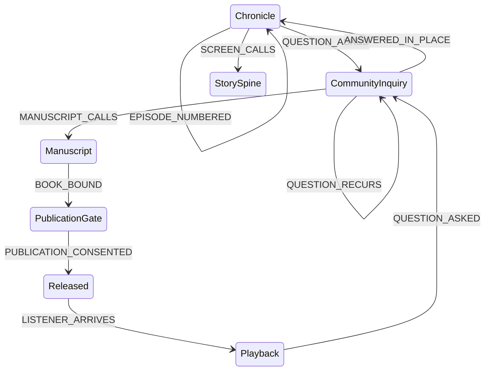

# Iteration 6 — a book has to be needed before it is written

**Stamp:** 2026-07-28 · applied, validated, committed
**From:** `after-5.smdf.json` (18 leaf states / 31 events) → `after-6.smdf.json` (19 leaf states / 34 events)

---

## What Guillaume said

> "One of the things that could transform a chronicle into a book are **recurring
> questions from the community**. Jerry has part of the community that developed
> something. So if I'm in a chronicle, I'm developing something, and I'm creating
> something, and it's used to make me treat a subject — it could be preparation of
> research and these things. But **I don't know if I'm going to do a book if there
> is no need for it**. So when the community ask a question or a requirement that
> they have, it might be an event that actually triggers the desire for
> transforming it into a book."

## What the machine was asserting, wrongly

`Chronicle --MANUSCRIPT_CALLS--> Manuscript`, described as *"the episodes have enough weight to hold covers."*

That made the book **self-justifying**: accumulate enough episodes and a book falls out. It is the same error as a metric that measures its own success — the chronicle both generated the material and certified that the material deserved covers. Nobody outside the work was consulted, and nothing could prevent a book that nobody wanted.

Guillaume's sentence inverts it. Weight is not need. A thousand episodes with no one asking is not a book; three episodes against a question that keeps returning is.

## Changes

### Added — `CommunityInquiry`

> *"A question or requirement arrives from the community — the people who built alongside, who read, who are waiting. One asking is a conversation. The same question arriving again is a need, and a need is the only thing that earns a book."*

| Event | Wiring |
|---|---|
| `QUESTION_ASKED` | `Chronicle → CommunityInquiry` — someone outside carries a question the work might answer |
| `QUESTION_ASKED` | `Playback → CommunityInquiry` — the audience becomes the community; what they met leaves them with a question |
| `QUESTION_RECURS` | `CommunityInquiry` **internal** — the same question returns from someone else; the inquiry deepens and stays itself |
| `MANUSCRIPT_CALLS` | `CommunityInquiry → Manuscript` — the need is shown; there is now a reason for covers |
| `ANSWERED_IN_PLACE` | `CommunityInquiry → Chronicle` — an episode already held the answer; no book is written, and nothing is lost |

**`Chronicle --MANUSCRIPT_CALLS--> Manuscript` is removed.** `Manuscript` is now reachable *only* through demonstrated need. That is the whole point of the iteration and it should be hard to undo by accident.

### Why recurrence is an internal transition

`QUESTION_RECURS` deliberately does not move anywhere. Recurrence is not a step toward the book — it is the *evidence* that accumulates inside the inquiry. A question can return five times and still resolve with `ANSWERED_IN_PLACE`. The self-loop is what makes "recurring" structural rather than decorative, exactly as `EPISODE_NUMBERED` does for the chronicle.

### `ANSWERED_IN_PLACE` is not a failure path

*"No book is written, and nothing is lost."* A machine that could only exit an inquiry by producing a book would be the self-justifying error again, relocated one state downstream. The community asking and the chronicle already answering is a **good** outcome, and the diagram now says so in its own voice.

### Adjusted

- `Chronicle` — *"The chronicle lengthens on its own; it does not ripen into a book on its own."* The sentence names the correction inside the state it corrects.
- `Manuscript` — *"Episodes gathered into chapters against a question that would not go away — the chronicle takes the shape of a book because someone needed one."*
- `MANUSCRIPT_CALLS` — *"A need has been shown rather than merely felt."*

### The `_CALLS` family now means one thing

`LAND_CALLS`, `SCREEN_CALLS`, `MANUSCRIPT_CALLS` — every calling in this machine now arrives from outside the maker. The land calls. The episodes call. The community calls. None of them is the producer deciding he is ready.

*(`SCREEN_CALLS` still fires from `Chronicle` directly. Whether the film deserves the same demand-side treatment as the book is deliberately unasked — Guillaume named the book, and the film is a work he has his own reasons for making. It is the obvious next question, not an obvious next edit.)*

---

## After

**19 leaf states · 34 events · validates clean.**



A second great loop closes, and it is a social one:

```
Chronicle → CommunityInquiry → Manuscript → PublicationGate → Released → Playback → CommunityInquiry
```

The audience that met the work becomes the community that asks the next question. The book is no longer something the chronicle produces — it is something the community draws out of it.

## Open

- Should `SCREEN_CALLS` route through an inquiry too, or is the film exempt because Guillaume has his own reason for it?
- The inquiry has no consent gate, and probably should not have one — a question is not a telling. But if a community *requirement* names people, that is a different object than a question, and the machine does not distinguish them.
- Still carried from iteration 5: the `contains` / `references` / `inspired_by` link vocabulary, the artefact's relation to the person inside it, JamAI's `spanMs`.

🌸: The chronicle used to be able to talk itself into a book. Now it has to be asked — twice, by different people — and it is allowed to answer "you already have it," which is the kindest sentence in the whole machine.
