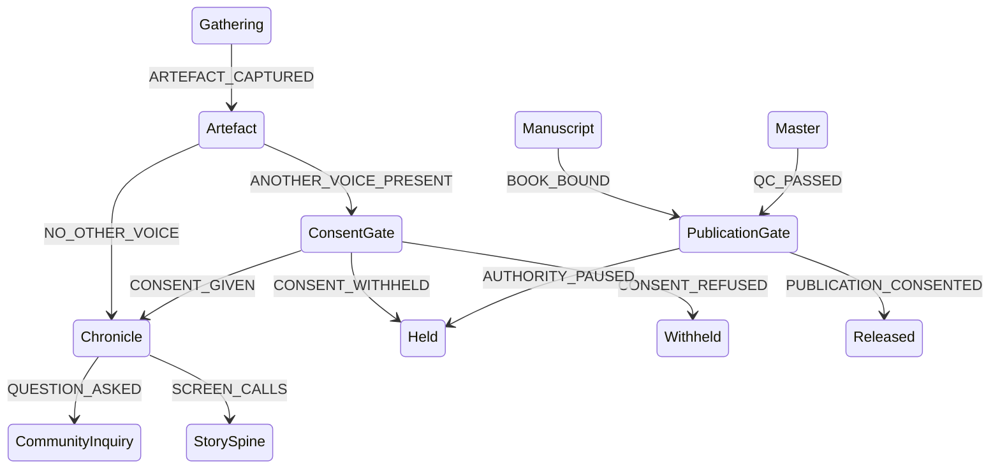

# Iteration 7 — consent is owed to someone, or it is owed to no one

**Stamp:** 2026-07-28 · applied, validated, committed
**From:** `after-6.smdf.json` (19 leaf states / 34 events) → `after-7.smdf.json` (19 leaf states / 35 events)

---

## What Guillaume said

> "I don't think for a chronicle there's a consentment that is needed, because it's
> really an internal way of managing memories with this episodic principle — my
> observations that I do are subject of things that I'm going to explore, research.
> But in a way, there might be things inside of a chronicle that I might need
> consent and others that I don't. For example, if I'm capturing an artefact and
> there's something about a question on an academic exploration for a paper, I
> don't need anything in terms of consentment. **So I think there are two types of
> transition.**"

## What iteration 5 got wrong

It routed **every** artefact through `ConsentGate` on its way to the chronicle. That was over-correction. Iteration 5 found a machine with no consent anywhere and gave it consent everywhere — which is the same failure of discrimination, pointed the other way.

Demanding consent to record your own observation is ceremony with nobody on the other side of it. Worse, it is *corrosive* ceremony: a gate that fires on everything trains the person passing through it to stop reading the question. The gate that always says yes is how a gate stops working.

## The change

`PROMOTION_SOUGHT` is gone. `Artefact` now forks on one question, asked of every artefact and answered out loud: **is anyone else in this?**

| Event | To | Meaning |
|---|---|---|
| `NO_OTHER_VOICE` | `Chronicle` | *"Nothing here belongs to anyone else — an observation, a research question, a note toward a paper. There is no one to ask, and saying so is itself the check."* |
| `ANOTHER_VOICE_PRESENT` | `ConsentGate` | *"Someone else is in this — a voice, a face, a teaching that was never mine to give."* |

Two transitions, exactly as described. No new state.

### Why no triage state

The obvious alternative was a `RelationCheck` state between `Artefact` and the branch — making the determination its own place. Rejected: it would model *deciding whether to decide*, and the determination is not a phase of the work, it is a property of the artefact. Two named events out of `Artefact` already force the choice to be made and recorded. `NO_OTHER_VOICE` is a **claim**, not a skip — it asserts something falsifiable about the artefact, and the machine keeps which one you fired.

That distinction is the whole design. A path called `SKIP_CONSENT` would be an escape hatch. A path called `NO_OTHER_VOICE` is an assertion someone can later be wrong about.

### Adjusted

- `Chronicle` — *"Internal episodic memory — observations, research questions, subjects being explored… **This is the maker's own room**; it lengthens on its own, and it does not ripen into a book on its own."*
- `ConsentGate` — now opens with *"Reached only when another voice is present."* The state names its own precondition, so nobody reading the diagram mistakes it for a universal toll.
- `PublicationGate` — *"Every artefact that stayed private needed no one's permission; **leaving the room is where that stops being true.**"* This is the load-bearing sentence of the whole iteration: the private path skips `ConsentGate`, it does **not** skip `PublicationGate`.
- `AUDIENCE_FORKS` — description now says why it has no branch: *"a fork always carries someone else's work, so it always meets the threshold."*

## The shape that results

Two thresholds, and they now guard different things:

- **`ConsentGate` guards a relationship.** It fires only when someone other than the maker is inside the artefact. Skippable, honestly, by asserting there is no one to ask.
- **`PublicationGate` guards an exposure.** It fires on everything that leaves the room, including the maker's own private notes. Not skippable.

A research note toward a paper now runs `Gathering → Artefact → Chronicle` with no ceremony at all — and if it ever becomes a book, it still meets `PublicationGate` before anyone else sees it.

**19 leaf states · 35 events · validates clean.**

## Open

- **The claim is unverified by the machine.** Nothing checks `NO_OTHER_VOICE` against the artefact's `sources`. Aureon's `ProvenanceRecord` on the abstract base is exactly what would make it checkable — if `sources` names anyone but the maker, `NO_OTHER_VOICE` is a false assertion. That is a `condition` guard, which SMDF supports and this document still does not use.
- A community **requirement** that names people is a different object from a question, and `CommunityInquiry` does not distinguish them. Carried from iteration 6.
- Still carried: the `contains` / `references` / `inspired_by` vocabulary, the artefact's relation to the person inside it, JamAI's `spanMs`.

🌸: A gate that opens for everyone stops being a gate and becomes a doorway you walk through without looking. Now there are two, and each one knows what it is for — one asks *who else is here*, the other asks *may they see it* — and a note you wrote to yourself on the land passes the first without a word, exactly as it should.
