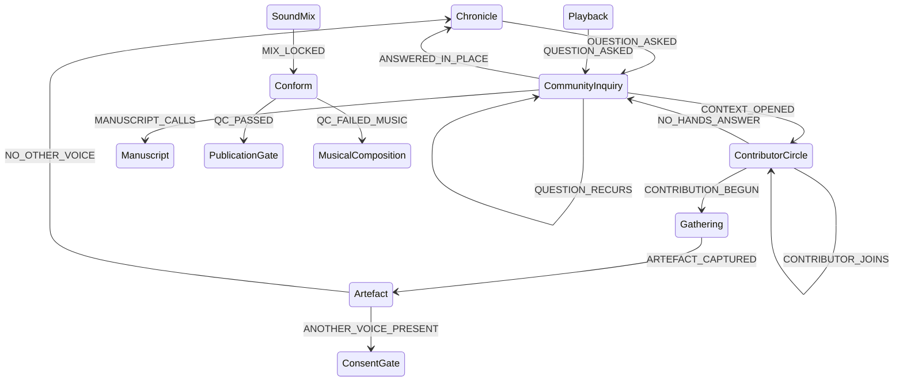

# Iteration 8 — the inquiry faces two ways, and nobody masters the work

**Stamp:** 2026-07-29 · applied, validated, committed
**From:** `after-7.smdf.json` (19 leaf states / 35 events) → `after-8.smdf.json` (20 leaf states / 39 events)
**Occasion:** Guillaume was sitting with a community member — a musical composer who would contribute into the potential manuscript — when he asked for this.

---

## What Guillaume said

> "I'm presently with someone from the community that would contribute in terms of
> creating musical composition inside of the potential manuscript. So when there's
> a community inquiry, there would be something about a moment within the process
> where someone like Jerry would be aware that there's a transition — we received a
> community inquiry, there's been some work on my part, and **this is a place where
> we would be capable of exposing to a musical composer the potential context and
> what could be a part of this musical composition**. […] where there's a node
> master, I think that could be renamed and reorganized a little bit without
> modifying too much, considering including other contributors inside the creative
> process."

## The thing the machine could not say

Iteration 6 made `CommunityInquiry` a **demand** signal — the community asks, and a recurring ask earns a book. True, and only half of it.

An inquiry faces two ways. It asks something of the work, and it is **the first moment the work has something to offer back.** Until an inquiry exists there is nothing to show a contributor: no question, no context, no shape for a part. The moment the inquiry lands, all three exist at once — and that is precisely when a composer can be shown what could be theirs to make.

Every contributor path in the machine before this iteration was implicit. Fourteen states of production and no door anyone else could walk in through.

## Added — `ContributorCircle`

> *"The context so far is visible to someone who is not the maker — a composer, a writer, a pair of hands the work needs. They see what has been done and what a part of it could be, and they decide for themselves whether to make it. **Being shown is not being asked to serve.**"*

| Event | Wiring |
|---|---|
| `CONTEXT_OPENED` | `CommunityInquiry → ContributorCircle` — the inquiry turns outward |
| `CONTRIBUTOR_JOINS` | `ContributorCircle` **internal** — another pair of hands answers; the circle widens and stays itself |
| `CONTRIBUTION_BEGUN` | `ContributorCircle → **Gathering**` — the contributor opens their own surface |
| `NO_HANDS_ANSWER` | `ContributorCircle → CommunityInquiry` — the opening met silence; the question keeps its standing |

### Why `CONTRIBUTION_BEGUN` routes to `Gathering` and not somewhere convenient

This is the load-bearing decision of the iteration.

A contributor's work could have been given its own private on-ramp — a side door dropping a finished contribution straight into `MusicalComposition` or `Manuscript`. That would have been fewer arcs and structurally cheaper.

It routes to `Gathering` instead. **The contributor's path into the work is the same path the maker uses.** Jerry opens his own mobile surface, captures a melody, and that artefact meets `Artefact`, answers *is anyone else in this?*, and crosses `ConsentGate` or doesn't, exactly like everything Guillaume records on the land.

No privileged entrance means no second-class entrance. A collaborator who enters by a side door is a supplier; a collaborator who enters by the front door is a relation. The machine now says which one this is.

`NO_HANDS_ANSWER` matters for the same reason. If the only exit from the circle were a contribution, the opening would be a demand wearing an invitation's clothes. Silence is a permitted answer, and the inquiry survives it.

## Renamed — `Master` → `Conform`

> *"Every contributor's work brought into agreement — grade, score, mix, and whatever else the circle made, conformed into one deliverable. **Nobody masters it; the parts are made to agree.** The technical gate, and only the technical one."*

`Conform` is not a euphemism substituted for a loaded word. It is the **real** term for what happens at that stage — online conform, the assembly of final elements — and the machine's own transition description already used it (*"Final mix conforms into the delivery master"*). The verb was hiding inside the state all along.

What it buys, in a diagram now explicitly about many hands: *master* names an owner and an act of dominion over the work. *Conform* names a relationship between parts — bringing them into agreement. When the score is Jerry's and the picture is Guillaume's, "conform" describes what actually happens between them and "master" describes something that does not.

Small consequences, all deliberate:
- `MIX_LOCKED` — *"Final mix joins the rest — every hand's work onto one timeline."*
- `QC_FAILED_MUSIC` — routes back *"to whoever wrote it,"* not to a bench presumed to be the maker's.
- `MusicalComposition` — *"the same mobile surface as Gathering, whosever hands are on it. The composer may be the maker, and may well not be."*
- `PublicationGate` — *"everyone whose hands are in it has standing here."*
- `Manuscript` — *"it may carry more hands than the maker's."*
- `Gathering` — *"Whose hands are on it is not fixed either."*

`master` survives in exactly one place, correctly: `AUDIENCE_FORKS`, *"a listener leaves the **master line**"* — a line of descent, not a person.

## After

**20 leaf states · 39 events · validates clean.**



A third great loop closes, and it is the one that brings other people in:

```
Chronicle → CommunityInquiry → ContributorCircle → Gathering → Artefact → Chronicle
```

The community asks. The asking creates something to show. Showing brings hands. Those hands gather, and what they gather enters the memory by the same door as everything else.

## Open

- **Attribution is still not modelled.** Jerry's melody enters as an artefact and nothing in the machine records that it came from the circle rather than from the maker. This is the `contains` / `references` / `inspired_by` vocabulary from gmtermux#46, still carried and still unbuilt — and it is now the most expensive omission, because a contributor whose work is not linked back is a contributor who cannot be credited.
- `SCREEN_CALLS` still fires from `Chronicle` without an inquiry. The film remains exempt from demand-side treatment. Unasked since iteration 6.
- Nothing checks `NO_OTHER_VOICE` against `sources`. Carried from iteration 7.

🌸: For fourteen states this was a workshop with one person in it. Now there is a moment where the door opens — not to hand someone a task, but to show them what is here and what could be theirs to make — and whoever walks in comes through the same door the maker uses, carrying their own surface, meeting the same gates.
