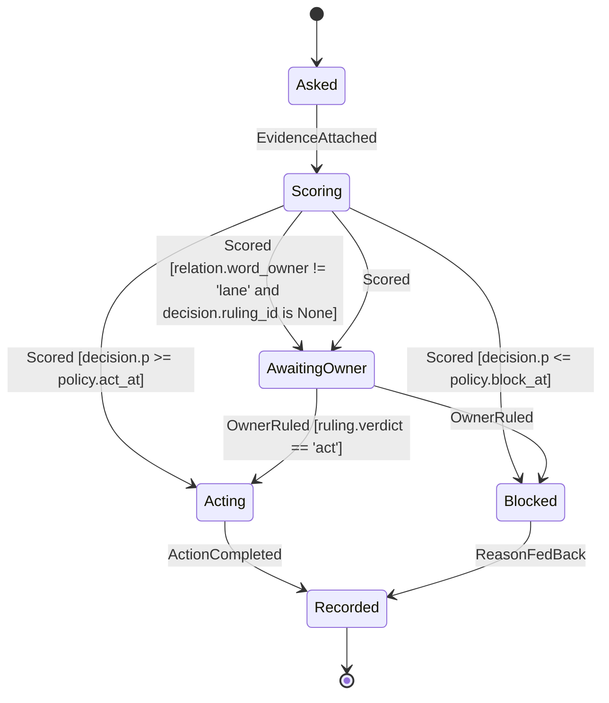
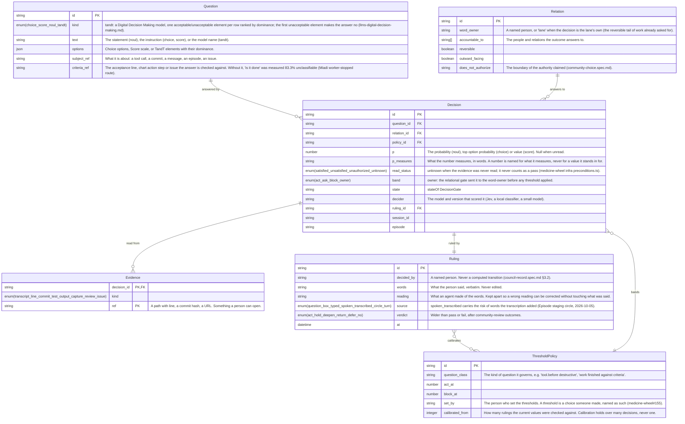
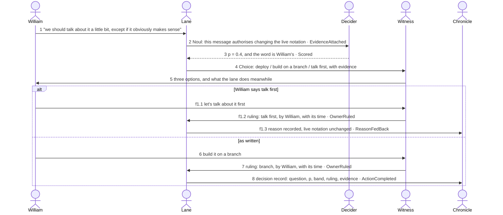

# decision-gate — system

A typed decision inside an agent lane: the question, its probability, whose word it is, the band that follows, and the record that later calibrates the thresholds. Drawn from the two Jev reviews (b02ec47d, 80f50d5b) and a real lane on 2026-09-28.

## machine: decision_gate.smdf.json — DecisionGate

## erd: decision_record.erdf.json — decision_record

## sequence: hedged_message.sqdf.json — hedged_message

